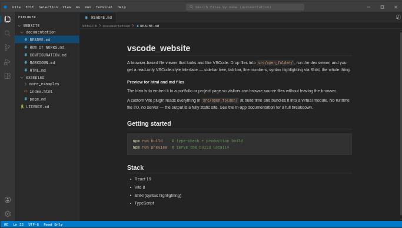
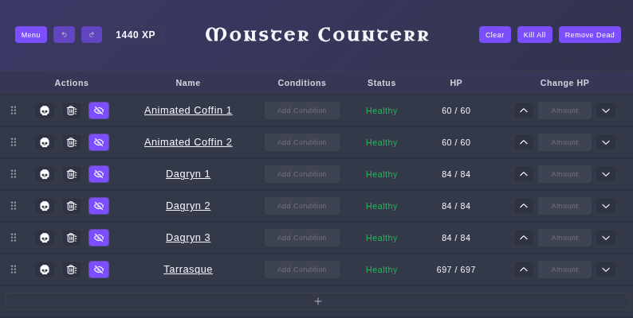
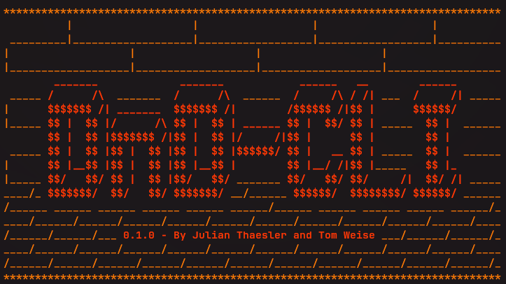

# Hello there, I'm Tom

As you can see there is a theme going one with my projects. A lot of purple and blue

## [VSCode Website](https://github.com/tonix401/vscode_website)

A framework and template for building your own portfolio or documentation site with the ✨ aesthetic ✨ of everyone's favorite code editor. Intended for cloning and customization. Check out the [live demo and docs](https://tonix401.github.io/vscode_website/) or the [demo video](assets/vscodewebsite_demo.mp4)

## [Monster Counter](https://tonix401.github.io/monster-counterr/)

A React web app (hence the extra _r_) for D&D game masters to manage combat encounters. Pull monster sheets directly from 5etools, and sync game state in real time with up to 25 players. Check out the [demo video](assets/monstercounterr_demo.mp4)

## [DnDCLI](https://github.com/tonix401/dndcli)

A terminal RPG set in a fantasy world with AI-driven storytelling and engaging minigames — every playthrough is unique. Features a polished UI built entirely from ASCII art. Requires an OpenAI API key. Check out the [demo video](assets/dndcli_demo.mp4)

## [Domus](https://github.com/DHBWLoerrach/TIF24B_AnwProjekt_A)

A self-hosted shared living management app, deployable via Docker. Manage shopping lists expenses and more comfortably

## [Uniplanner 3000](https://github.com/akoSiThaesler/uniplanner3000)

A web app for managing university resources — teachers, courses, schedules, and more.

## [Quarrelships](https://github.com/tonix401/quarrelships)

A game of battleships in the form of a java desktop app with processing as the graphics library
